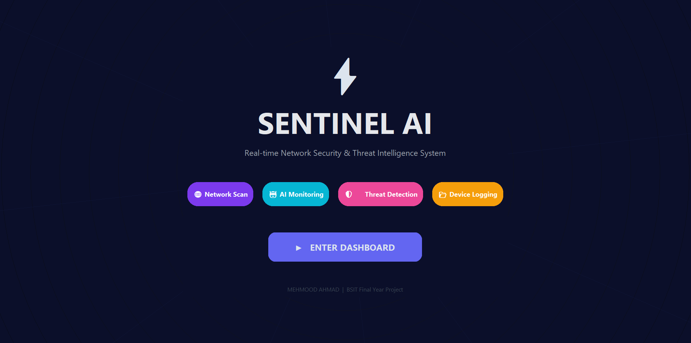
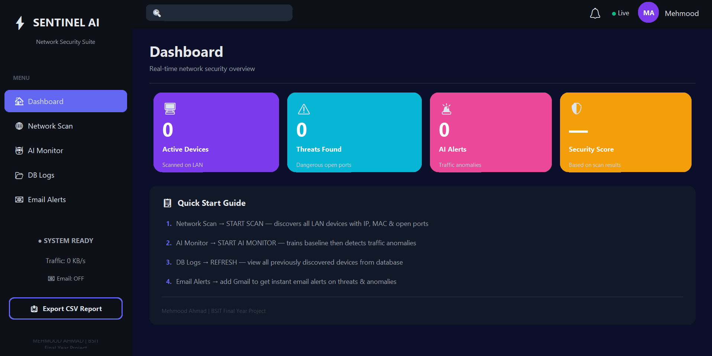
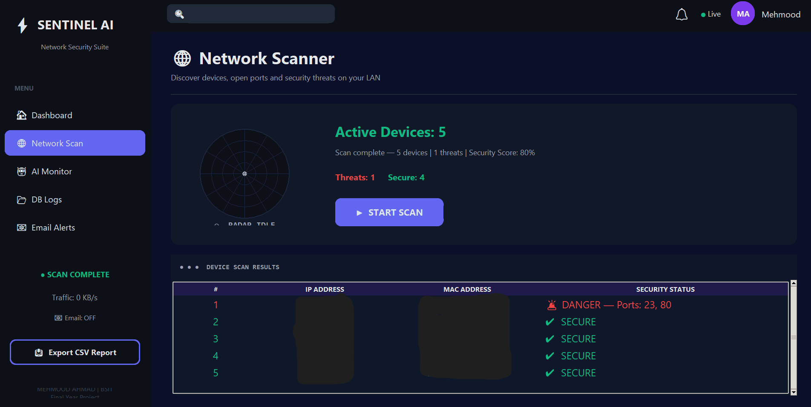
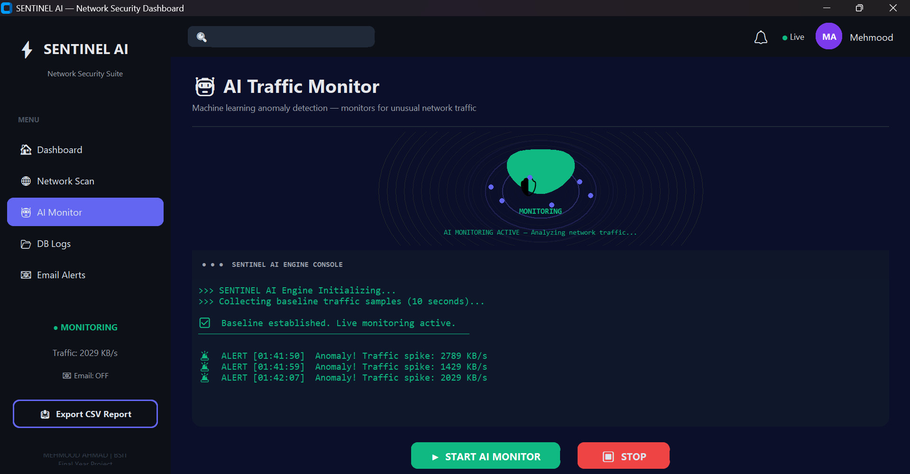
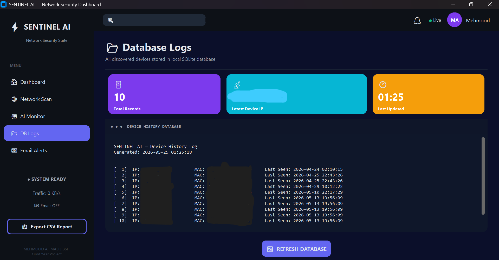
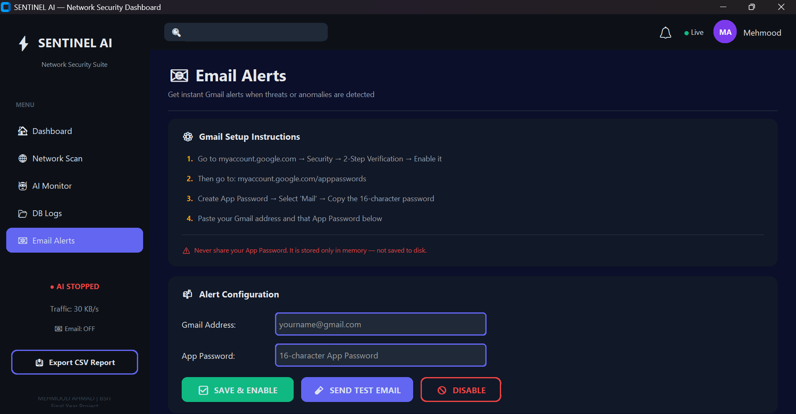

# Sentinel AI: Intelligent Network Monitoring & Threat Detection System

### Final Year Project | BS Information Technology
Developed as an AI-powered Network Security Solution for intelligent monitoring, threat detection, and automated security alerting.

---

## Introduction
Sentinel AI is an intelligent cybersecurity solution designed to monitor network activity, detect suspicious behavior, identify security threats, and provide real-time alerts.

The system combines network scanning, port analysis, machine learning-based anomaly detection, device logging, and automated email notifications within a modern security dashboard.

---

## Key Features

✔ **Real-Time Network Device Discovery** (IP & MAC Address Detection)

✔ **Open Port Scanning** & Dangerous Port Identification

✔ **AI-Powered Anomaly Detection** using Isolation Forest Machine Learning Model

✔ **Live Traffic Monitoring** & Interactive Cybersecurity Dashboard

✔ **Automated Email Alerts** on threat detection

✔ **Data Management:** SQLite Device Logging & CSV Report Export

---

## Technologies Used
- **Language:** Python
- **GUI Framework:** CustomTkinter
- **Database:** SQLite3
- **Machine Learning:** Scikit-Learn (Isolation Forest)
- **Network & System Analysis:** Scapy, Psutil, Threading
- **Alerting System:** SMTP (Email Automation)

---

## Skills Demonstrated (Recruiter Impact)
This project demonstrates practical, production-level knowledge of:
- **Cyber Security & Network Security**
- **Threat Detection & Security Monitoring**
- **Python Development & Security Automation**
- **Machine Learning Application** (Anomaly Detection)
- **Database Management & Network Analysis**

---

## Project Screenshots

### 1. Landing Page
*Dashboard main entry interface.*

### 2. Security Dashboard
*Live monitoring overview.*

### 3. Network Scanner
*Real-time network discovery and port assessment.*

### 4. AI Monitoring
*Isolation Forest model detecting live traffic anomalies.*

### 5. Database Logs
*SQLite device activity history.*

### 6. Email Alert System
*Automated security alerts sent instantly.*

