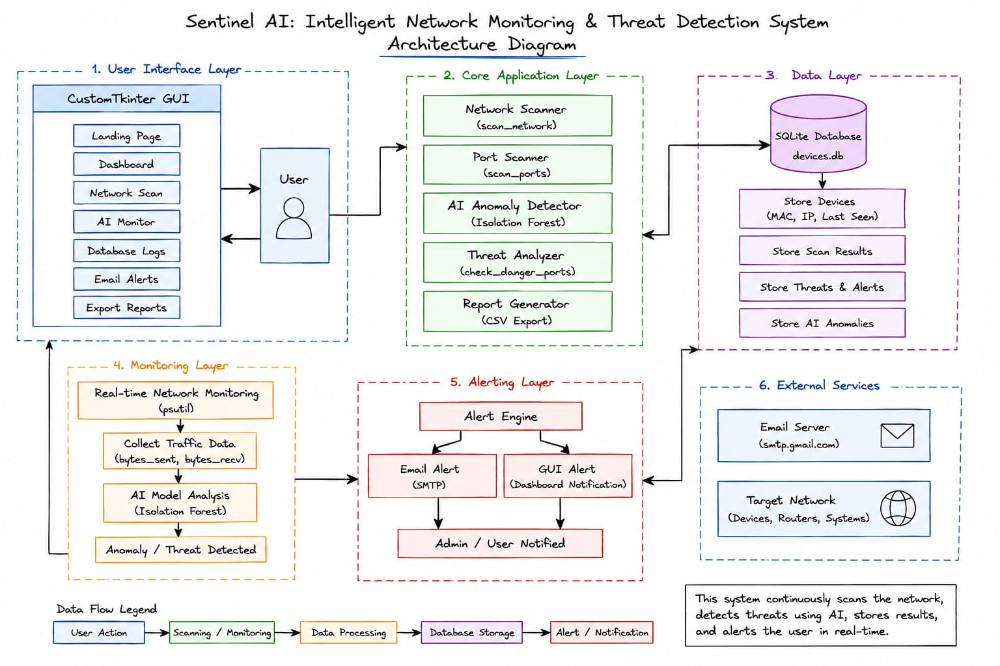
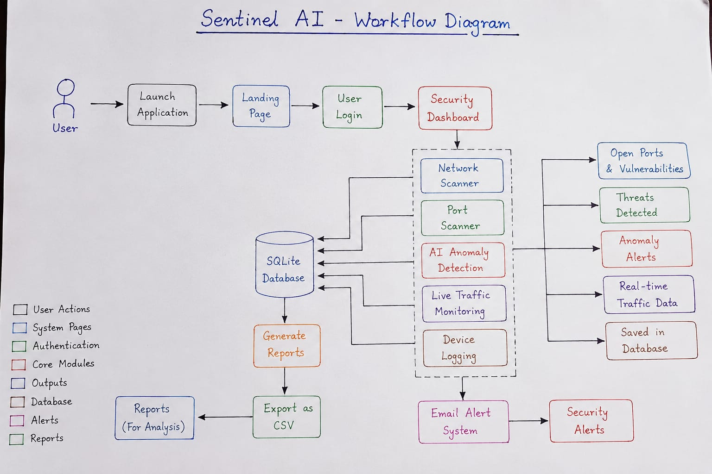
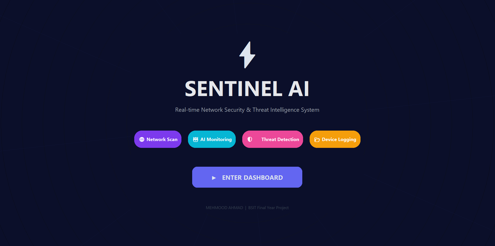
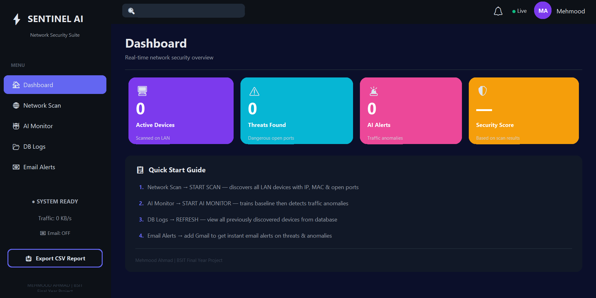
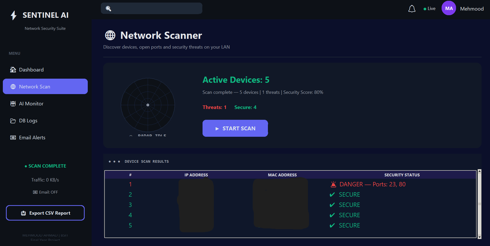
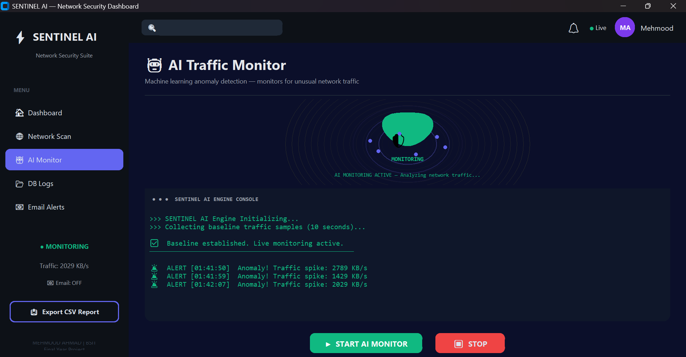
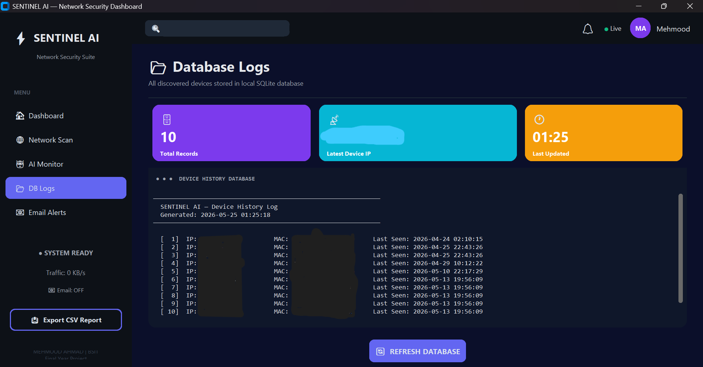
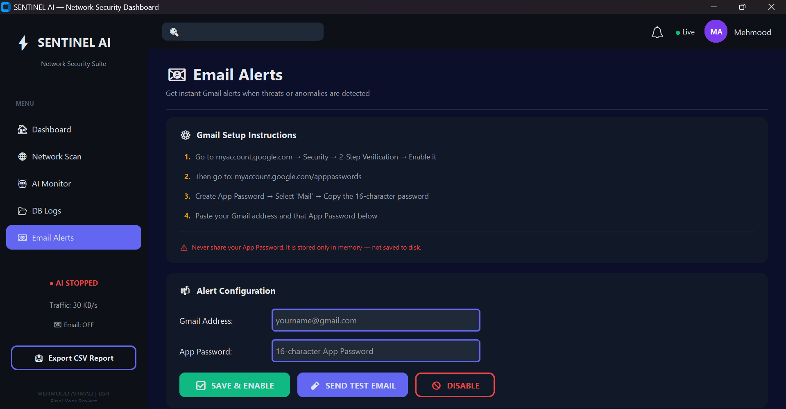

<div align="center">


# Sentinel AI: Intelligent Network Monitoring & Threat Detection System

### Final Year Project | BS Information Technology

**Developed as an AI-powered Network Security Solution for intelligent monitoring, threat detection, and automated security alerting.**

</div>

---

# Introduction

Sentinel AI is an intelligent cybersecurity solution designed to monitor network activity, detect suspicious behavior, identify security threats, and provide real-time alerts.

The system combines network scanning, port analysis, machine learning-based anomaly detection, device logging, and automated email notifications within a modern security dashboard.

---

# Key Features

✅ Real-Time Network Device Discovery (IP & MAC Address Detection)

✅ Open Port Scanning & Dangerous Port Identification

✅ AI-Powered Anomaly Detection using Isolation Forest Machine Learning Model

✅ Live Traffic Monitoring & Interactive Cybersecurity Dashboard

✅ Automated Email Alerts on Threat Detection

✅ SQLite Device Logging & CSV Report Export

---

# Technologies Used

- **Language:** Python  
- **GUI Framework:** CustomTkinter  
- **Database:** SQLite3  
- **Machine Learning:** Scikit-Learn (Isolation Forest)  
- **Network & System Analysis:** Scapy, Psutil, Threading  
- **Alerting System:** SMTP (Email Automation)  

---

# Skills Demonstrated (Recruiter Impact)

This project demonstrates practical hands-on knowledge of:

- Cyber Security & Network Security  
- Threat Detection & Security Monitoring  
- Python Development & Security Automation  
- Machine Learning Application (Anomaly Detection)  
- Database Management & Network Analysis  

---

# Requirements

- Python 3.10+  
- Windows OS (Recommended)  
- Active Network Connection  

Required Libraries:

- customtkinter  
- psutil  
- scikit-learn  
- scapy  

---

# Installation

### Clone Repository

```bash
git clone https://github.com/YOUR-GITHUB-USERNAME/Sentinel-AI-Network-Security-System.git
```

### Move to Project Folder

```bash
cd Sentinel-AI-Network-Security-System
```

### Install Dependencies

```bash
pip install -r requirements.txt
```

---

# How to Run

```bash
python gui.py
```

### Execution Flow

1. Launch Dashboard  
2. Scan Network Devices  
3. Detect Open Ports  
4. Start AI Monitoring  
5. Receive Threat Alerts  

---

# Architecture Diagram

<div align="center">



</div>

---

# Workflow Diagram

<div align="center">



</div>

---

# Project Screenshots

## 1. Landing Page
Dashboard main entry interface.



---

## 2. Security Dashboard
Live monitoring overview.



---

## 3. Network Scanner
Real-time network discovery and port assessment.



---

## 4. AI Monitoring
Isolation Forest model detecting live traffic anomalies.



---

## 5. Database Logs
SQLite device activity history.



---

## 6. Email Alert System
Automated security alerts sent instantly.



---

# Project Structure

```bash
Sentinel-AI-Network-Security-System/
│
├── gui.py
├── scanner.py
├── port_scanner.py
├── ai_anomaly.py
├── database.py
├── constants.py
├── requirements.txt
├── README.md
│
├── screenshots/
│   ├── landing_page.png
│   ├── dashboard.png
│   ├── network-scan.png
│   ├── ai-monitor.png
│   ├── database-logs.png
│   └── email-alerts.png
│
├── diagrams/
│   ├── architecture-diagram.jpg
│   └── workflow-diagram.jpg
│
└── docs/
    └── Project_Report.pdf
```

---

# Future Improvements

- SIEM Integration (Splunk / ELK)  
- Cloud Security Monitoring  
- Advanced Threat Intelligence  
- Malware Detection Module  
- Web-Based Dashboard Deployment  

---

# Author

**Mehmood Ahmad**  
BSIT Graduate | Cybersecurity | Network Security | SOC Operations | AI-Based Threat Detection  

LinkedIn: **https://www.linkedin.com/in/mehmood-ahmad-cybersecurity**